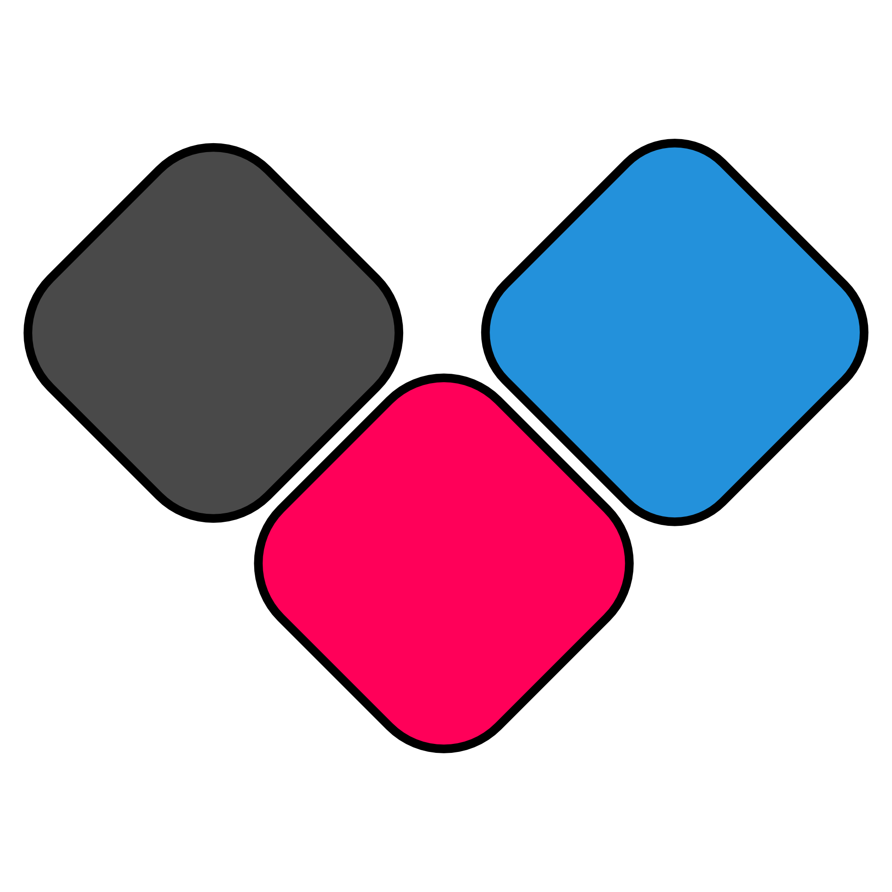

# Freedeck 

 
<i>The FOSS alternative to the Elgato Stream Deck.</i>

 

## Getting Started with Freedeck

### Instructions (Easier Than Easy)

- Go to [https://freedeck.app](https://freedeck.app)
- Click "Download"
- Run the installer
- Click "Install" in the installer
- You're done! Check the start menu for a shortcut!

### Instructions (Super Duper Easy)

- Clone the repo
  - Run this in your terminal to clone the repo (to retain git info for autoupdater)
  - ` git clone https://github.com/Freedeck/Freedeck.git `
- Go to where you cloned the repo in File Explorer
- Run `init.bat`
- Profit

### Instructions (Semi-Advanced)

- Clone the repo
  - ` git clone https://github.com/Freedeck/Freedeck.git `
- Download NPM packages
  - `npm i`
- Run the program!
  - `npm run start`
- Enjoy!

### Instructions (Easily Advanced??)

For those who want the simplicity of the Installer, but need the complexity of the codebase.

- Follow the *Instructions (Easier Than Easy)*
- Now, you can go to your user directory, documents, Freedeck, then Freedeck again!
  - Let me break the command down for you.
  - `cd C:\Users\You\Documents\Freedeck\freedeck` (You need the last "freedeck"! That's the actual repo!)
- Kaboom! You can now open Freedeck in VSCode, NeoVim, or any other editor/IDE!

The moment you start Freedeck, a setup wizard will launch. Follow those instructions. Next, when Companion launches, you'll see another setup wizard. Follow those instructions.

From there, Freedeck is ready to use.
